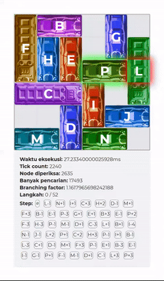

# 🚗 Rush Hour Puzzle Solver



A fast and interactive **Rush Hour Puzzle Solver** implemented in **JavaScript**, complete with multiple algorithms, custom heuristics, a web-based GUI, and automated visualization features.

## 🔧 Features

- ✅ Supports multiple solving algorithms:
  - **Uniform Cost Search (UCS)**
  - **Greedy Best-First Search (GBFS)**
  - **A\*** and **Iterative Deepening A\*** (IDA*)
  - **Approximate variants** of A\* and IDA\* for performance comparison
- 🧠 Heuristic options:
  - **Car Distance**
  - **Blocking Cars**
  - **Recursive Blocking Analysis**
- 🌐 Web interface with:
  - Input via text or file upload
  - Algorithm and heuristic selector
  - Visualized solution playback with animation
- 🎥 **Video Output**:
  - One-click recording of solution animation
  - Automatically saves animations for all puzzles
- 🚀 Deployed on a private VM via [rushhour.bwks.link](https://rushhour.bwks.link)

## 📦 Deployment

This project is deployed on a private **Windows Server 2022 Datacenter** (4 vCPU, 4GB RAM, 92GB Disk). The server is publicly accessible via a **Cloudflare Tunnel** and uses **Cloudflare DNS** with the domain [rushhour.bwks.link](https://rushhour.bwks.link). The deployment is expected to stay online for approximately 3 months.

## 📽 Bonus: Video Recording

Enable `showRecorder = true` in the browser console to activate automatic recording. When triggered, the solution animation plays and is saved to the file system—ideal for generating documentation or showcasing algorithm performance. Refer to [record-format.txt](./test/record-format.txt) for the format the recorder is expecting.

## 🧪 Algorithm Analysis

- **UCS** guarantees optimal solutions by exhaustively exploring possible moves. Optimized with `QueueSolverUniform`, though still slower due to lack of heuristic guidance.
- **GBFS** is faster in wall-clock time but often finds suboptimal paths as it greedily picks the lowest heuristic value without considering cost.
- **A\*** balances exploration and direction by combining path cost and heuristic value, offering a solid trade-off between optimality and speed.
- **IDA\*** implements A\* using a recursive stack, saving memory, though JavaScript engine optimizations may reduce noticeable benefit.

## 🔍 Heuristic Analysis

- **Car Distance**: Heuristic based on the minimal moves for the primary car to reach the goal. This heuristic is not admissable, because a distance of > 1, would be over-counted since it still only requires 1 cost.
- **Blocking Cars**: Admissible and generally stronger than Car Distance by considering immediate blockers.
- **Recursive Blocking**: More accurate than basic blocking analysis, though more computationally expensive per tick.

## 📌 Conclusion

This project successfully implements a Rush Hour puzzle solver according to specifications using JavaScript. It offers a full stack of search strategies, visualization, deployment, and export capabilities.

## 💻 Developing

Simply install the dependency and run the project. Node version v24.0.2 is recommended.
```sh
git clone https://github.com/NadhifRadityo/Stima-Tucil3-13523045
npm install
npm run dev
```

To run test run these commands. The script will automatically output its results to [`test/README.md`](./test/README.md) and [`test/test_output.log`](./test/test_output.log).
```sh
cd test
node test.mjs
```
